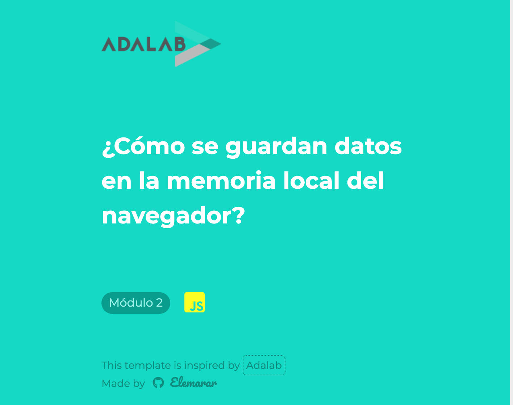
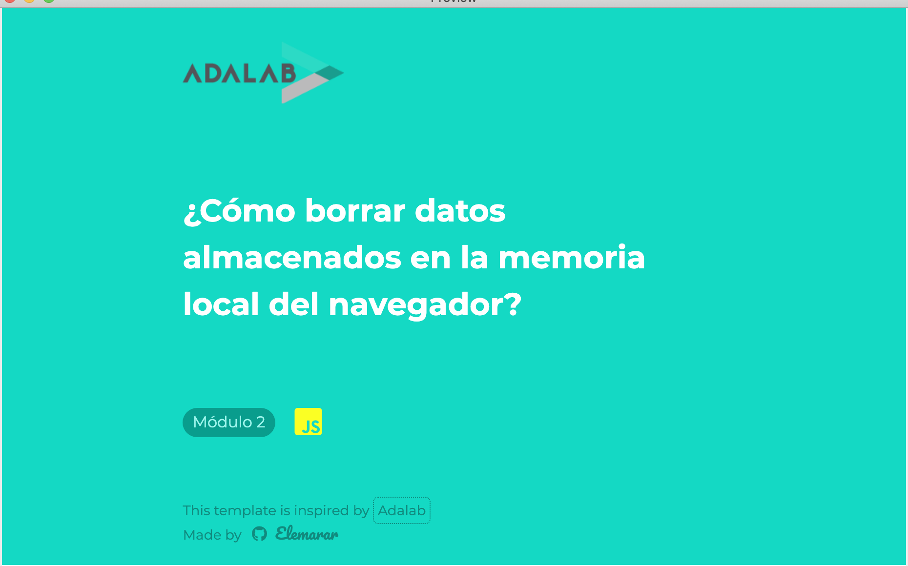
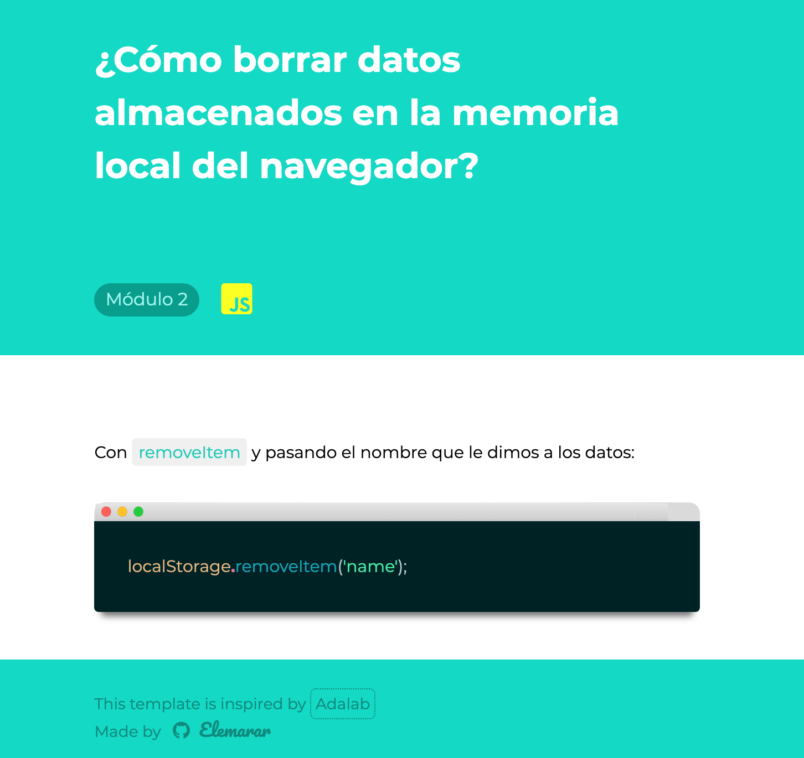
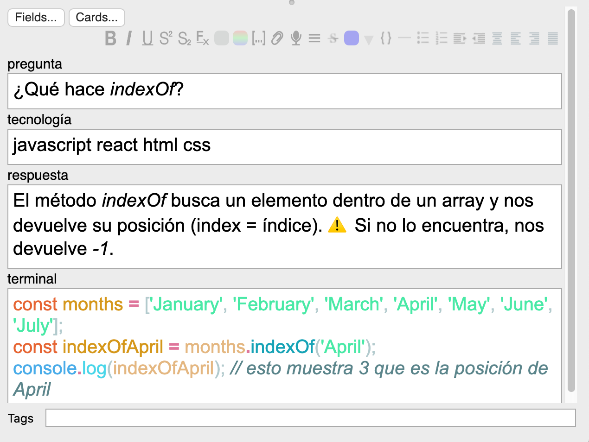
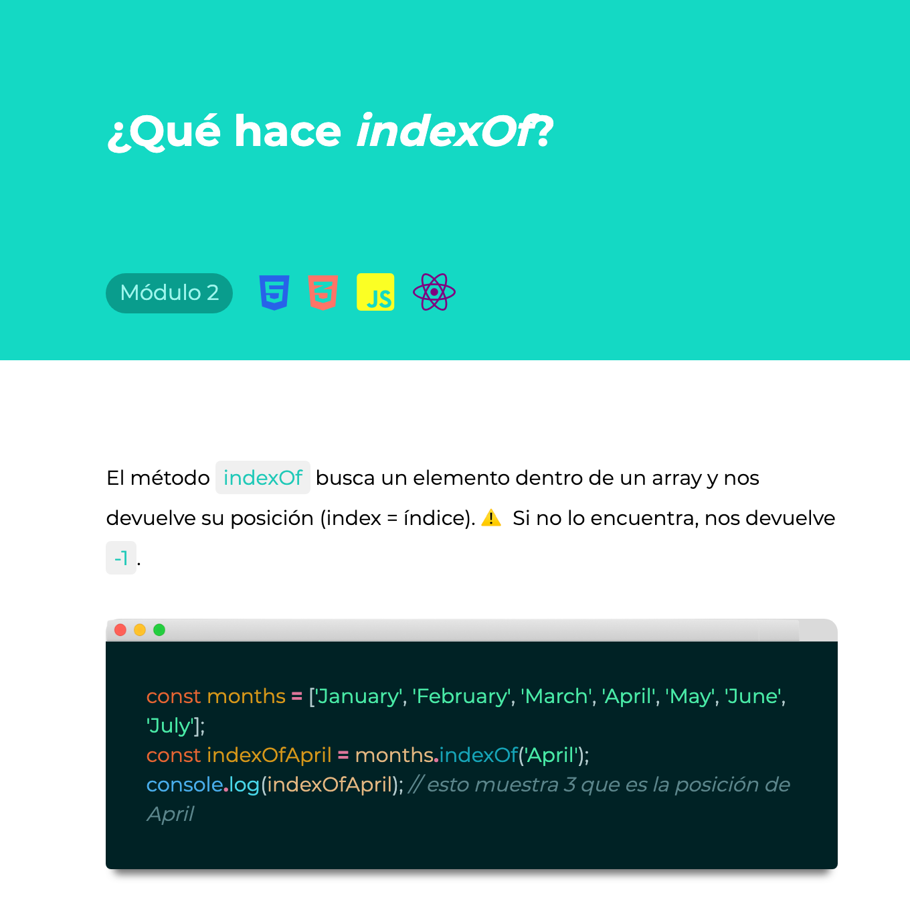

# Adalab template

¡Hola! Este es un template de tarjetas Anki inspirado en el diseño de [Adalab](https://adalab.es/). El objetivo de este template es aprender los conceptos de programación que se nos enseñan en el curso de Adalab. Puedes ver una simulación de cómo se ve este template [aquí](./index.html). Para descargarlo pulsa aquí: [Descarga]()

## ¿No conoces Anki?

Anki es un programa de flashcards **magnífico** que nos permite estudiar utilizando la **repetición espaciada**. Básicamente creas una tarjeta con una **cara A**, que es una pregunta sobre un concepto, un problema que resolver, etc, y luego te muestra la **cara B** con la solución. Anki te hace tests y dependiendo de si aciertas o fallas, te mostrará las preguntas con más frecuencia o menos. De esta manera, si fallamos mucho en un concepto, Anki nos lo mostrará con más frecuencia para que lo aprendamos mejor. Si por el contrario, acertamos siempre otra tarjeta, Anki hará que dicha tarjeta nos aparezca con menos frecuencia. Es lo que se denomina la **repetición espaciada**

 Te recomiendo que le eches un ojo a la [página oficial de Anki](https://apps.ankiweb.net/), su [manual en español](https://apps.ankiweb.net/docs/manual.es.html). Si quieres algún recurso más amigable siempre puedes buscar algún vídeo en youtube sobre aquí o algún post de blogs. Yo aquí me voy a limitar a presentar el template que hice.

---

Anki nos permite personalizar nuestras tarjetas utilizando **HTML, CSS** y **JavaScript** con lo cual podemos hacer que se vean realmente bien e incluso meterle un poco de interactividad.  Puesto que estamos aprendiendo estos lenguajes es una idea fantástica el crear tu propia tarjeta de Anki jugando con HTML, CSS y Js. 

Aquí presento mi template:

## Estudiando las tarjetas

Mi template cuenta con una sola tarjeta de dos caras. Una cara A que te hace una pregunta sobre un concepto que hayamos aprendido en el curso y una cara B que te muestra la respuesta.

### Cara A

En la cara A aparece el logo de Adalab, la pregunta en blanco y grande y debajo el número del Módulo al que pertenece el concepto que estamos añadiendo así como un icono que representa el lenguaje o tecnología que tiene que ver con la pregunta. 

> Lo he hecho de manera dinámica, así que si en el input de "tecnologías" en vez de escribir "javascript" escribes "react" te aparecería en icono de react. Pero esto lo veremos más adelante.

### Cara B

La cara B incluye la pregunta arriba, y además nos muestra la solución. La parte de la solución puede incluir un texto don de se explique el concepto así como la imagen de una terminal donde pondríamos el código relacionado con el concepto.

---

## Introduciendo los datos

El template cuenta con 4 campos a rellenar:

1. la pregunta
2. la tecnología utilizada (iconos 👉🏻 podemos utilizar más de una)
3. la respuesta
4. la terminal
5. el número de módulo

> En esta imagen podemos ver cómo es la interfaz de Anki cuando estamos rellenando los campos. 

La imagen superior nos daría de resultado:

**Sobre los iconos**

Actualmente la tarjeta acepta los siguientes iconos (aquí pongo las keywords exactas):

- javascript
- git
- react
- css
- html

> En el ejemplo de arriba hemos escrito todas, así que nos aparecen todos los iconos. 

**Estilos especiales en la respuesta**:

👉🏻 Cuando escribimos la respuesta, si ponemos una palabra en negrita aparecerá con un fondo verde y si la ponemos en cursiva, aparecerá como en la imagen superior, con un fondo gris --> esto está pensado para poner el código. Como lo que ponemos normalmente `así` 

**Sobre la terminal**

⚠️ Si quieres que en la terminal se vean los colores NO debes copiar el código a la terminal directamente. Te recomiendo pegarlo en el visual code (si es html, en una hoja de html, si es javascript en una hoja javascript, etc.) y después copiar y pegarlo en el campo de terminal. De esta manera, se importan los estilos de colores de visual code. 👉🏻 De lo contrario, nos saldría el texto en negro. 

---

## Échale un ojo a los vídeos

He subido un par de vídeos de cómo crear una tarjeta y cómo se ven cuando las estudias en el ordenador y en el móvil. Los vídeos se pueden ver aquí:

- [Cómo crear una tarjeta](./readme-videos/prueba-crear.mov)

- [Cómo se ve en el móvil](./readme-videos/prueba-móvil.mov)

- [Cómo estudiar](./readme-videos/prueba-estudiar.mov)

  

---

Si tienes algún problema con el template o alguna idea, ¡mándame un mensaje o ábreme un issue! ¡Al turrón, 🙇🏻‍♀️!