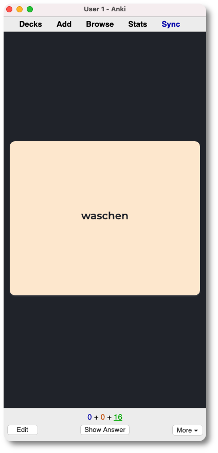
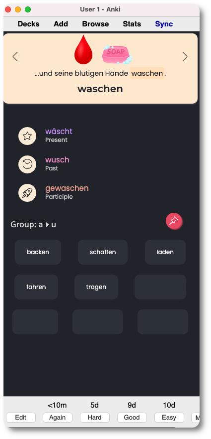
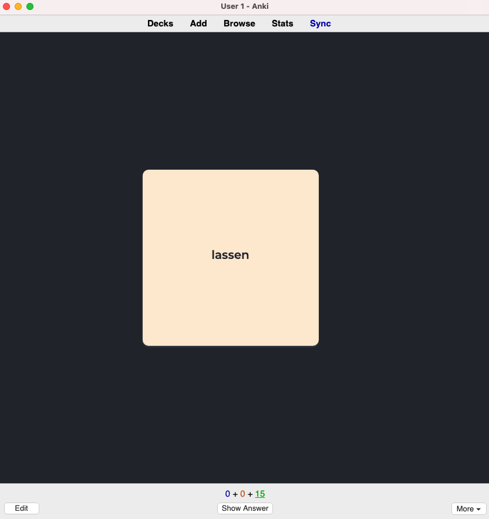

# German starke Verben


This template for [Anki](https://apps.ankiweb.net/) allows you to study the [starke Verben](https://en.wikipedia.org/wiki/Germanic_strong_verb)  (strong verbs). All the verbs included in the package have been taken from this [source](https://www.deutschplus.net/pages/Tabelle_starker_Verben)  **although** verbs marked as *C2* have been excluded since they aren't used as often.


---

## Features

**Each card includes:**

- The verb in German.
- The conjugation of the verb in present 3d person, past and participle.
- A list of other verbs that belong to the same group and are conjugated likewise.
- A story in German that includes the group verbs to better remember them all. It include pictures.


---

## Views

| Front                               | Back                              |
| ----------------------------------- | --------------------------------- |
|      |      |
|    |    |
|  |  |


---

### Modifying the stories

I kept the stories separated from the main html section of Anki so if you want to modify the story for a certain card or group of card you have to edit that card and specifically the html of the field `story` that is between `<style>` and `<script>` as you can see in the following gif:

% GIF%

The structure of a story is:

```html
<div class="story">
  <!--- Slide 1 -->
  <div class="story__item" style="display: block;">
    <!-- Here the images to appear on top of the story, as many as you want -->
     
    <!-- One paragraph for the story. Remember to wrap the key verb with the <b> tag so that it stands out in the story -->
    <p class="story__text">Der Bäcker hat einen speziellen Kuchen gebacken (<b>backen</b>).</p>
  </div>
  <!-- Slide 2 -->
  <div class="story__item" style="display: none;">
    
    
    <p class="story__text">...und der Bäcker slägt(<b>schlagen</b>) ihn.</p>
  </div>
</div>
```

> Remember that if you add your own images in local, you have to paste them in the Anki [media folder](https://docs.ankiweb.net/#/files?id=file-locations) in order for them to appear in Anki and be sync with your mobile device.


---

### Download

- Download template [here]()🔗 .
- Download media (images) here and paste them in the [media folder](https://docs.ankiweb.net/#/files?id=file-locations) of your Anki. 