# German Vocabulary Cards

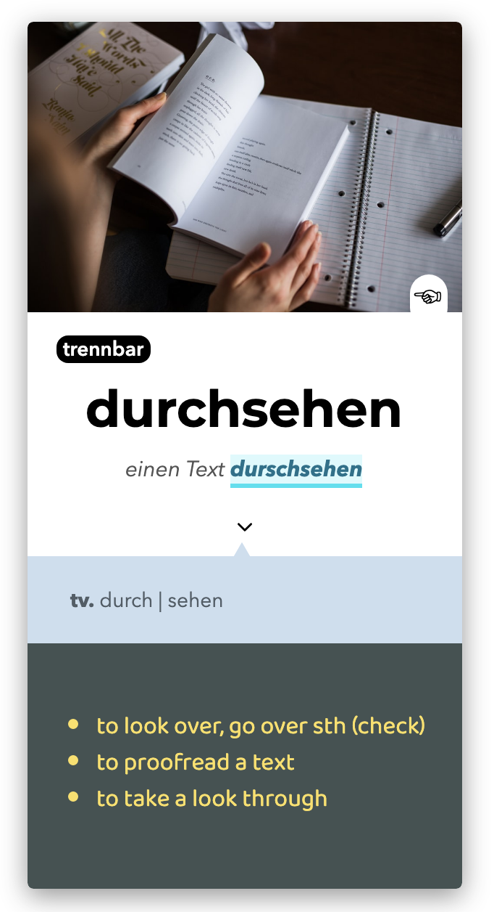

 

This is my German vocabulary card template! I use this card to train new words (not sentences). It includes a picture related to the meaning of the word, a hint that shows up when hovering over the picture and some extra information that appears when clicking on the arrow. For a preview, click [here](https://elemarmar.github.io/my-anki-collection/templates/german-vocab/index.html). If you want to download the template you can do so from here: [Download](https://github.com/elemarmar/my-anki-collection/blob/master/files/german-vocab.apkg).

## Study & Usage

- When you create a card, a reverse card will automatically be generated :

  - **German > Native language card**
  - **Native language > German card**

---

### DE > EN

  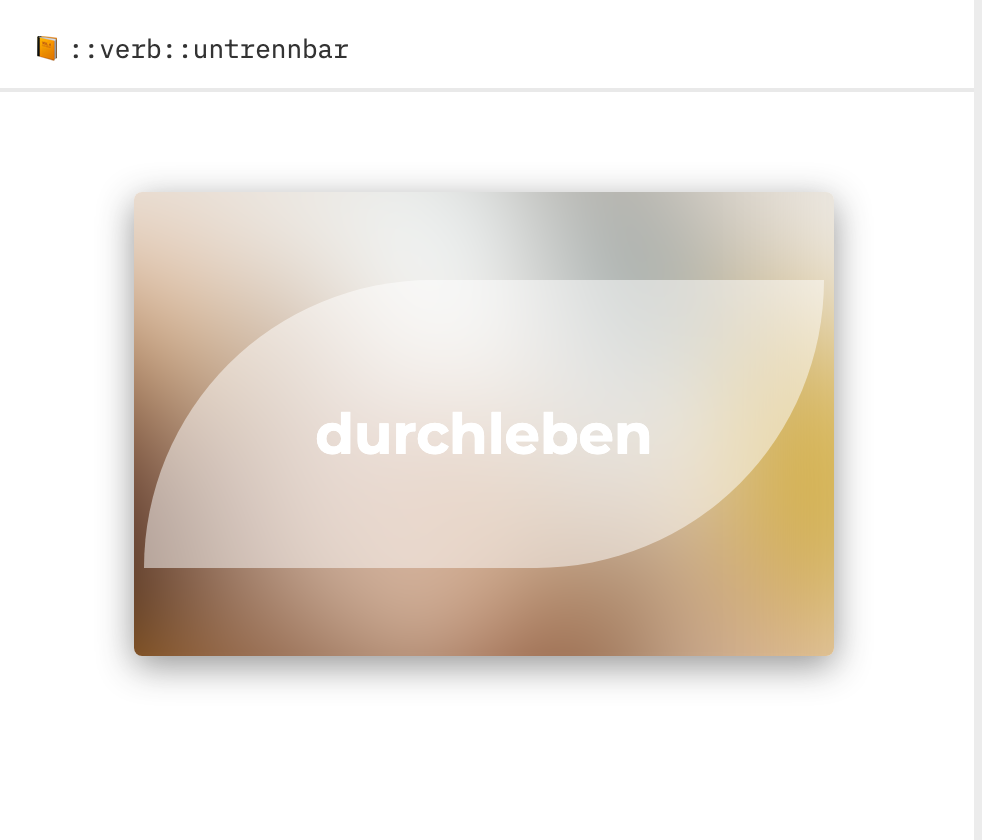 

The front card displays the German word. The background consists of a blurred version of the uploaded image to allow for quizzing and in order to differentiate the cards.

  

The back card shows the now clear image related to the German word. Hovering (mouse) or tapping on (mobile) the image will reveal the hint:

  

The next area is the word area. Here we find the word in German, some examples and a tag that identifies the word type. This is very useful when trying to differentiate between trennbar and untrennbar verbs:

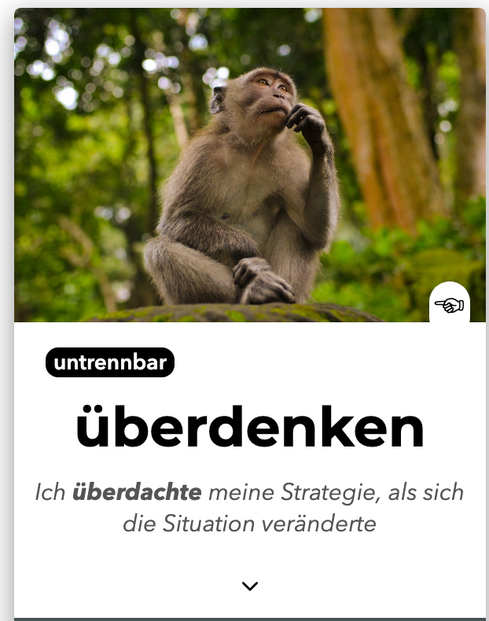

Below the examples is an arrow which, upon clicking or tapping, will open a drop menu which reveals extra information about the word—e.g. fixed expressions or for forms:

  

Finally, an English translation and a German definition are located at the bottom. Üben macht den Meister! 

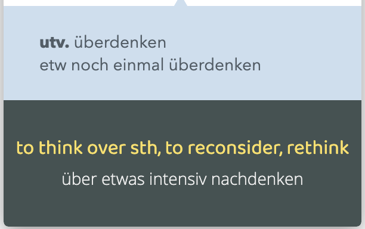

---

## EN > DE

The front card shows a related image, a translation of the target vocabulary and a fill-in-the-blank example sentence. This is particularly useful not only for training vocabulary recall but also for practicing ancillary information such as conjugations and declensions.

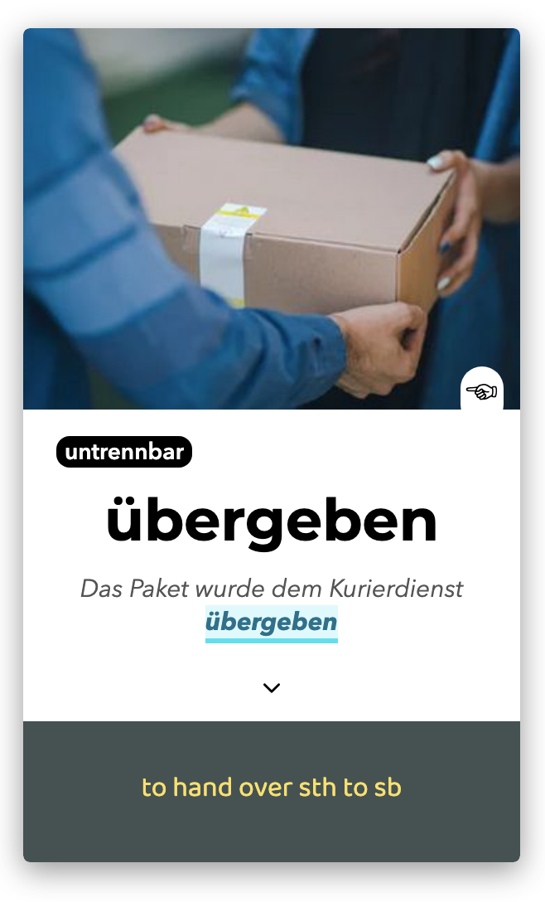

The back card is identical to the back card for DE > EN with the exception that the keyword in the example is styled differently. 

---

### Input

1. This template has 9 inputs:

   1. **front:** target word
   2. **front+:** the target word + any additionaly information. When training the word "Mann," for example,  "Mann" should be entered in **front**, and "Mann, der" in **front+** so that both meaning and gender are quizzed.
   3. **translation**
   4. **example**
   5. **extra**
   6. **cover (picture)**
   7. **cover-tip (hint)**
   8. **definition**
   9. **word type** (trennbar, untrennbar, ...)
   

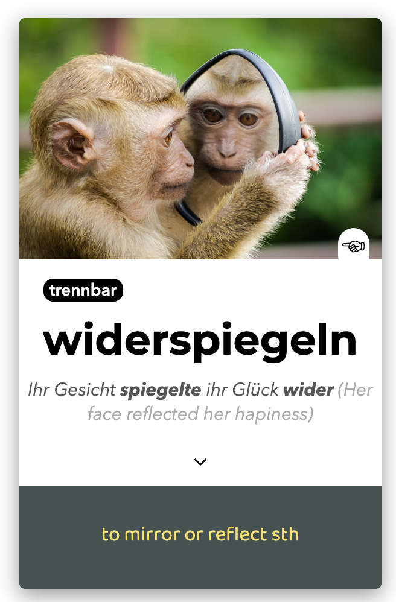

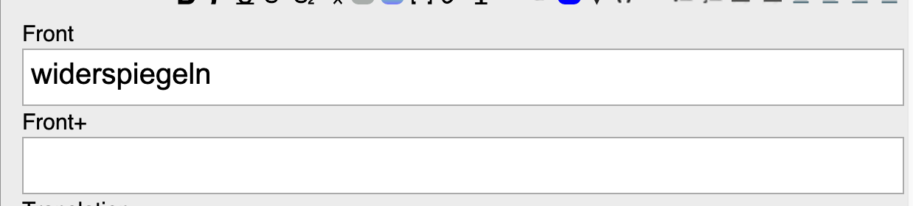

In this example only **front** is filled in, since this verb doesn't contain extra info. Below are two examples which demonstrate the difference between cards with and without **front+**:

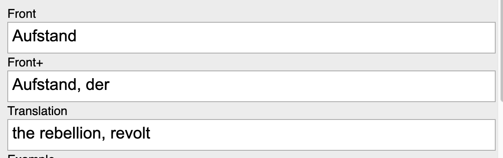

Here, dealing with a noun,  **front+** reinforces both vocubulary recall as well as gender:

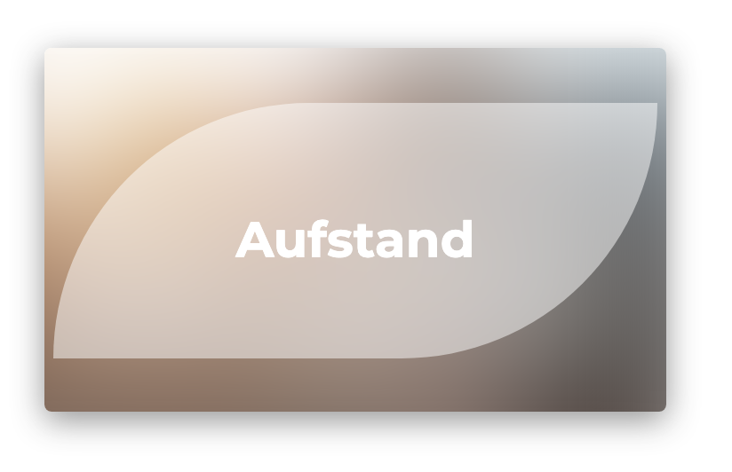

> Note how it doesn't ask for "der Aufstand" --> we have to guess the gender!
> 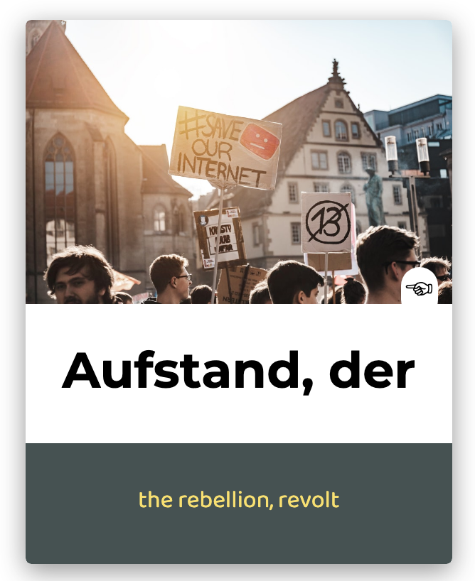

> **Front+** will be displayed on the back of the card unless the field is left empty, in which case, **Front** will be displayed instead.

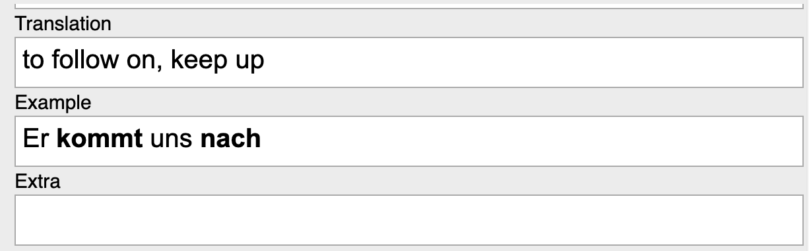

⚠️ **Important**: To hide words in the German example sentence, simply enter the desired words in **bold**:

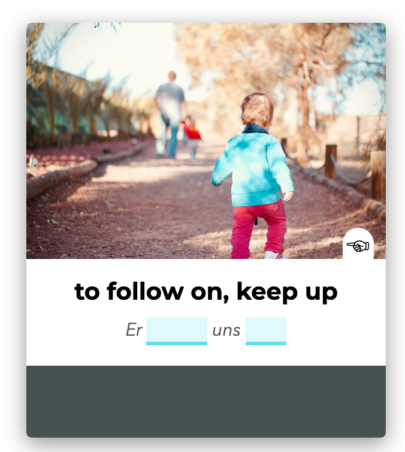

> Notice how no extra information is provided in this example. Below is an example featuring extra info.
> 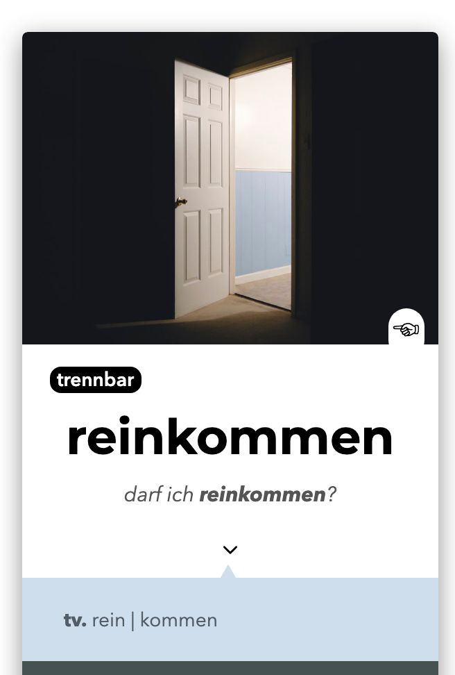
> 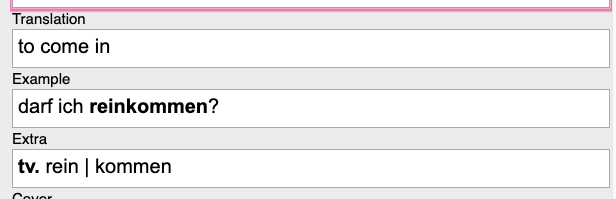

Last but not least, the image field, cover-tip field, definition and word type fields:

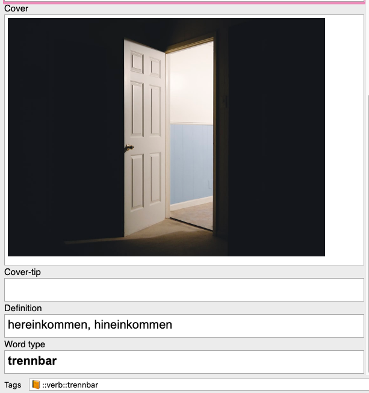

>  Images can simply be copied and pasted into the field. 

⚠️ **Important**: Words entered in word type field must be entered in **bold**. In order to avoid unwanted grouping, it is important that the spaces between tags *not* be bold.  Bolded spaces will result in word grouping as seen below.

> Writing the following:
> 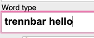
>
> with a bold space will yield:
>
> 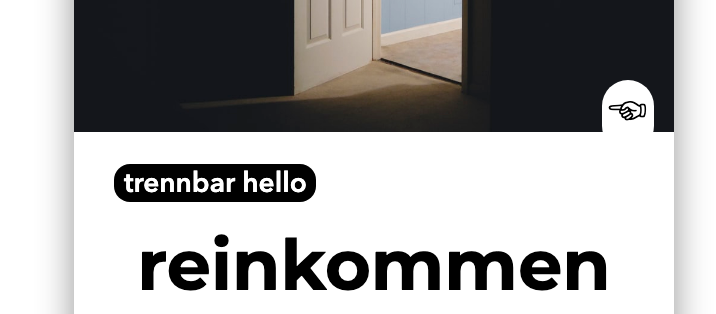
>
> To fix this, simply "unbold" the space between words:
>
> 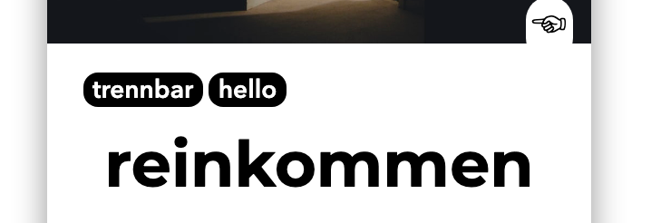

> 👉🏻  Cool and konstenlose images can be found at [Unsplash](https://unsplash.com/) which will make your cards more pleasant to look at! 

---

And this is how it works! Again, everything can be previewed and toyed with [here](https://elemarmar.github.io/my-anki-collection/templates/german-vocab/index.html). To download the template, click on [Download](https://github.com/elemarmar/my-anki-collection/blob/master/files/german-vocab.apkg).

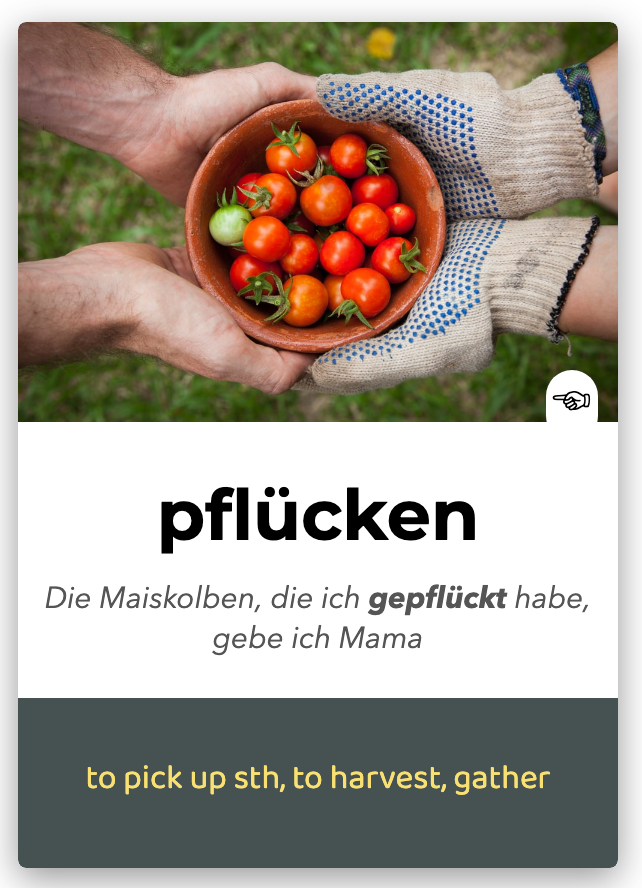

Bear in mind I'm still working on improvements and cleaning up the code. If you have any suggestions, encounter any bugs or  would like me to design a card template for you, let me know! 🦊

