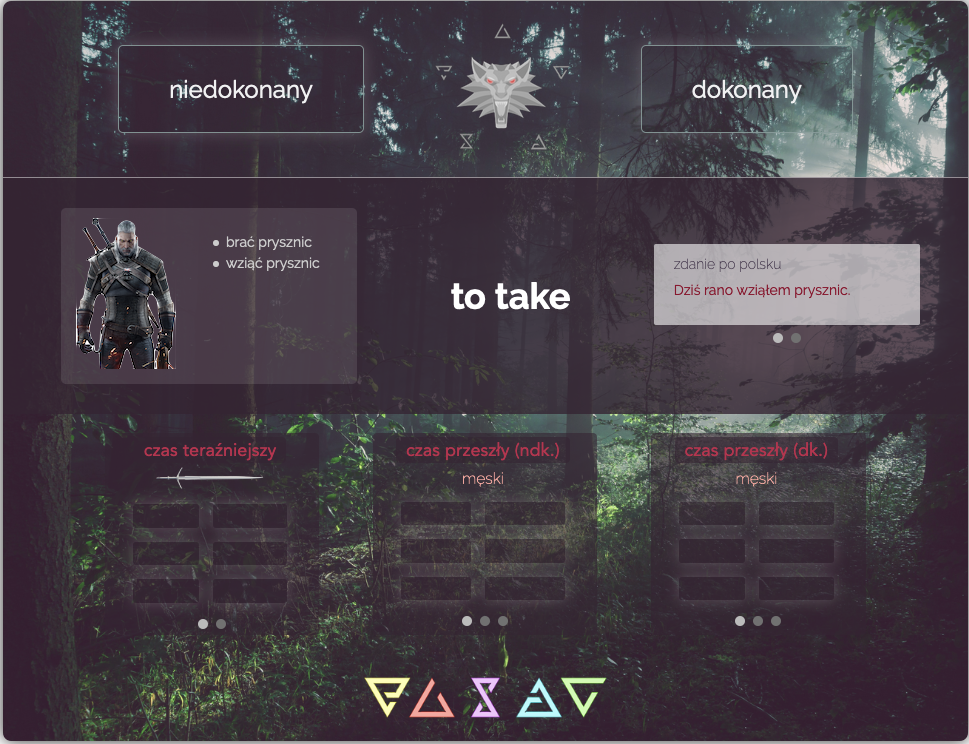
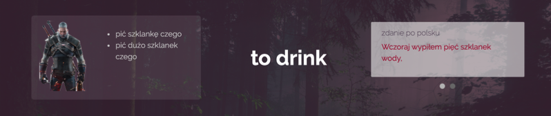
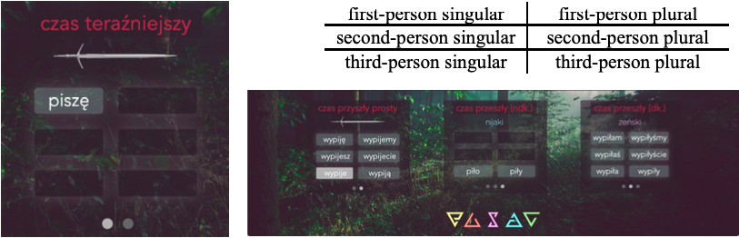
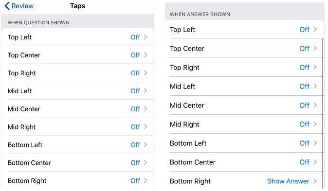
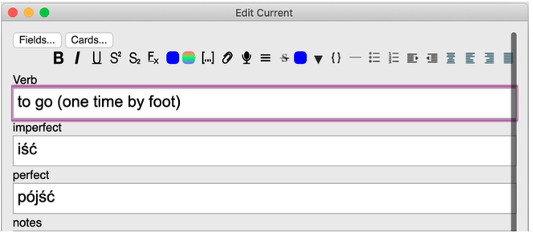
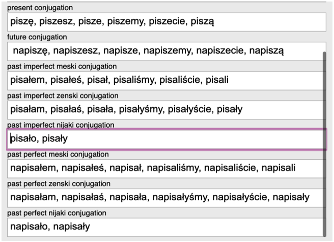
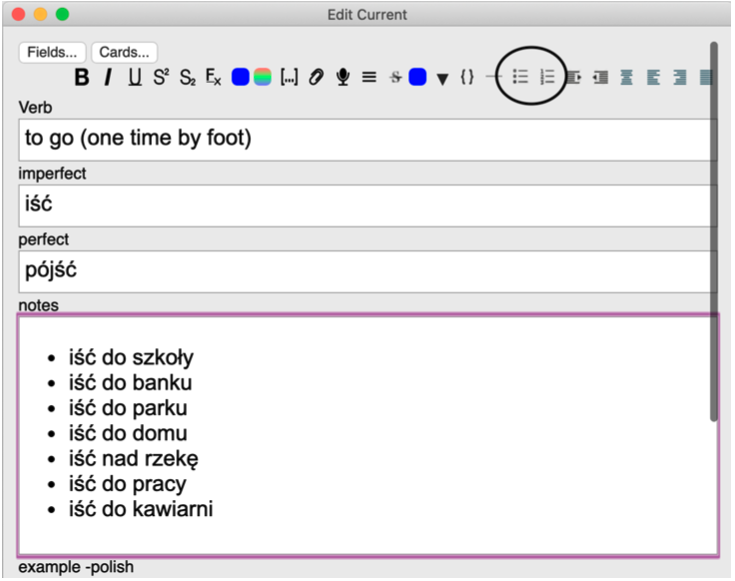
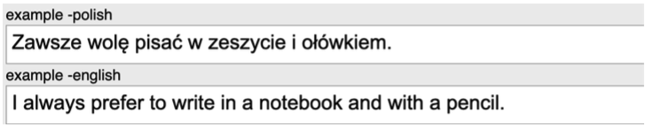

# Polish Verb Cards (Witcher)

This Witcher-themed card template is designed to serve as a comprehensive study aid for the Polish verbs in the present, simple future and past tenses[^1]. The template allows verbs to be marked as imperfective (niedokonany), perfective (niedokonany) or both in the case of aspectual pairs[^2]. Past forms can be studied by gender (masculine, feminine neuter).

---

## **Study & Usage**

The upper third of the card (computer version) features two verb fields which hide and test the infinitive forms. Tapping on the desired verb field will reveal the Polish infinitive.

The middle third displays a field for ancillary notes (left), the target word in English (center) and a field for example sentences in both Polish and English. To cycle between Polish and English, click or tap on the darkened circle beneath the field. Fields can be displayed in either direction as desired.

The bottom third displays the various verb tables (see footnote 1). Verb forms may be tested in any order. To reveal, tap or click on the rectangle containing the desired verb form. To cycle between tables, click or tap on the darkened circles beneath the field. Fields can be displayed in either direction as desired. Verb tables are always ordered as follows:

This card is suitable for usage on computers, tablets, and mobile devices.

**IMPORTANT**: To avoid revealing all fields upon tapping when using a touch interface, it is important to adjust the interface settings: (settings iconàreviewàtaps). Set each location to ‘off’ with the exception of ‘bottom right,’ which may changed to ‘show answer’.

---

### Input

1. Enter the English infinitive in field titled ‘verb’

2. Enter the Polish infinitive in the proper aspective field (.e.g. ‘pisać’ in ‘niedokonany,’ ‘napisać’ in ‘dokonany.’ Unfilled fields will be automatically filled with ‘Ø.’

   

3. Verbs must be entered in the following notation, using a comma followed a space as the division marker:

   > first-person singular, second-person singular, third-person singular, first-person plural, second-person plural, third-person plural

   

   **IMPORTANT**: Neuter subjects in the past tense (e.g. krzesło, krzesła) exist only in the third-person singular and plural. The neuter forms are entered as follows:

   > third-person singular, third-person plural

   

   All extraneous verb forms may be omitted will automatically be filled ‘Ø.’

4. Type any ancillary notes into the field titled ‘notes.’ It is recommendable to use one of the list functions located in the tools bar for each individual entry.

   

5. Example sentences may be entered into their respective fields—Polish into ‘example - polish’ and English into ‘example -english.’

   

---

[^1]: czas teraźniejszy - present tense :: czas przyszły prosty - simple future :: czas przeszły - past tense
[^2]: niedokonany (ndk.), dokonany (dk.)
[^3]: męski - masculine :: żeński - feminine :: nijaki – neuter3 

------

